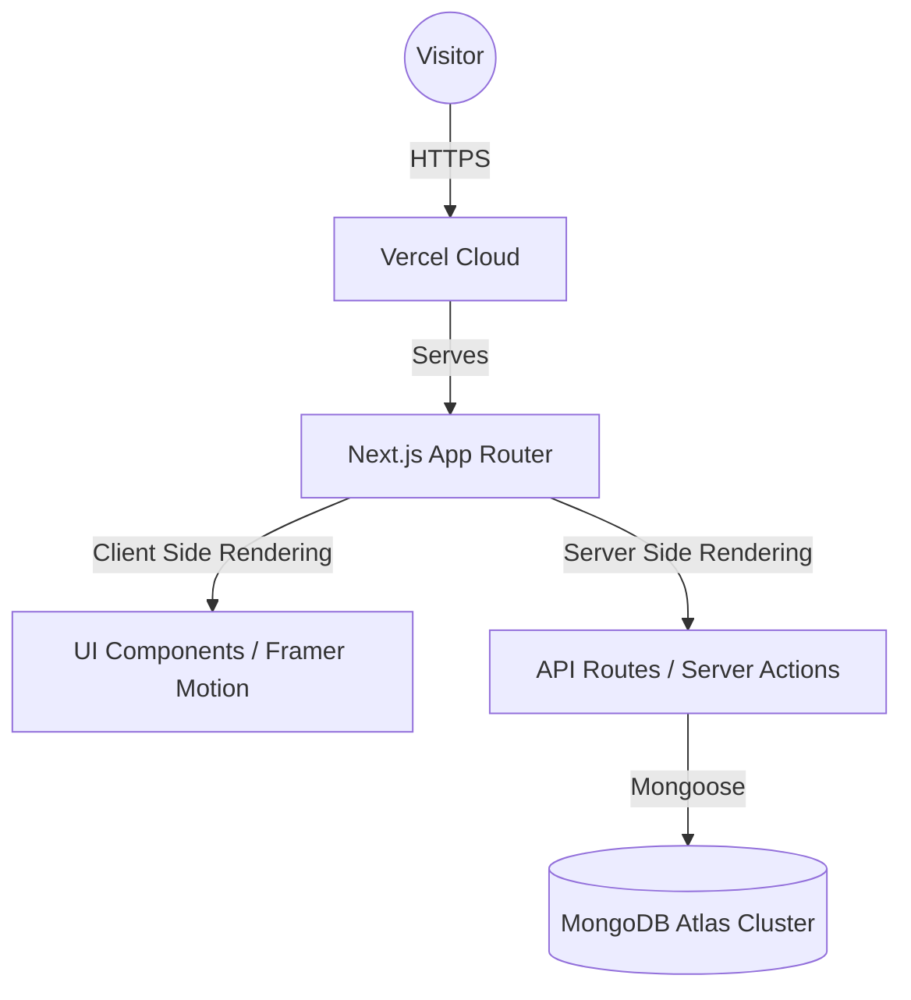

# 📄 Technical Manual: Professional Full-Stack Portfolio
**Developed by:** Samuel Lemaiyan (Parsilanka)  
**Version:** 1.0.0  
**Build Date:** March 15, 2026

---

## 1. System Architecture Overview

This portfolio leverages a **Modern Serverless Architecture** using the Next.js 15 framework. It is designed for maximum performance, SEO optimization, and ease of content management.

### 1.1 Technical Stack
- **Framework**: Next.js 15 (App Router)
- **Language**: TypeScript (Strongly typed)
- **Database**: MongoDB Atlas (Distrubuted Cloud Storage)
- **ORM**: Mongoose (Schema-based modeling)
- **Styling**: Tailwind CSS 3.4+
- **Animations**: Framer Motion 11+
- **Icons**: Lucide React
- **Hosting**: Vercel (Auto-scaling serverless environment)

### 1.2 Block Diagram


---

## 2. Frontend Design & UX

The frontend is built with a **Mobile-First Responsive Design** strategy and a "Black Hole" dark-mode aesthetic.

### 2.1 Design Tokens
- **Primary Color:** `#3b82f6` (Blue-500)
- **Background:** `#0a0a0a` (Rich Black)
- **Surface:** `#171717` (Neutral-900)
- **Typography:** `Geist Sans` & `Geist Mono` (Standard Vercel typography for high readability)

### 2.2 Key UI Features
- **Hero Section**: Utilizes text-reveal animations and high-contrast typography.
- **Project Cards**: Implements hover-scaling and glassmorphism effects.
- **Timeline (Experience)**: A vertical, animated line connecting professional milestones.
- **Contact Form**: Real-time validation and localized API error handling.

---

## 3. Database Layer & Modeling

We use a non-relational document structure to allow for flexible data types (e.g., varying tech stack lists for projects).

### 3.1 Data Schemas

#### 3.1.1 `Project` Schema
| Field | Type | Description |
| :--- | :--- | :--- |
| `title` | `String` | Unique project identifier |
| `description` | `String` | Detailed summary |
| `techStack` | `[String]` | Array of technologies used |
| `githubUrl` | `String` | Link to source code |
| `liveUrl` | `String` | Optional link to deployment |
| `imageUrl` | `String` | Path to public asset or remote URL |
| `featured` | `Boolean` | Flag for priority display |

#### 3.1.2 `Experience` Schema
| Field | Type | Description |
| :--- | :--- | :--- |
| `role` | `String` | Professional title |
| `company` | `String` | Organization name |
| `startDate` | `String` | Formatted date (e.g., "Jan 2023") |
| `endDate` | `String` | Formatted date or "Present" |
| `responsibilities` | `[String]` | Achievement bullet points |
| `order` | `Number` | Sorting priority |

---

## 4. API & Backend Operations

The backend consists of serverless functions that connect to MongoDB on-demand.

### 4.1 Endpoints Specification

#### GET `/api/projects`
- **Description**: Retrieves all projects sorted by creation date.
- **Security**: Public Read
- **Response**: `Array<Project>`

#### GET `/api/experience`
- **Description**: Retrieves work history sorted by `order` field.
- **Security**: Public Read
- **Response**: `Array<Experience>`

#### POST `/api/contact`
- **Description**: Receives and validates contact form submissions.
- **Fields Required**: `name`, `email`, `message`
- **Response**: `201 Created` on success.

---

## 5. Deployment & Configuration

### 5.1 Environment Configuration
The system requires a `MONGODB_URI` which points to a specific database: `portfolio`. 
**Configuration Example:**
`mongodb+srv://<user>:<pass>@cluster0.cfgvp.mongodb.net/?dbName=portfolio`

### 5.2 Build Optimization
To handle React 19 / Next 15 dependency resolution on legacy Vercel instances, the following `vercel.json` is used:
```json
{
  "installCommand": "npm install --legacy-peer-deps"
}
```

---

## 6. Maintenance & Troubleshooting

### 6.1 Common Errors
| Error | Cause | Solution |
| :--- | :--- | :--- |
| `db.find is not a function` | Model not compiled | Check Mongoose singleton export. |
| `504 Timeout` | Cold Start / Atlas Pause | Ensure Atlas cluster is active. |
| `400 Bad Request` | Missing Form Data | Check Frontend `Contact.tsx` state mapping. |

### 6.2 Adding Images
All project images should be placed in `/public/images/`. Reference them in the database using relative paths: `/images/project-name.png`.

---
*Generated by Antigravity AI for Samuel Lemaiyan.*
